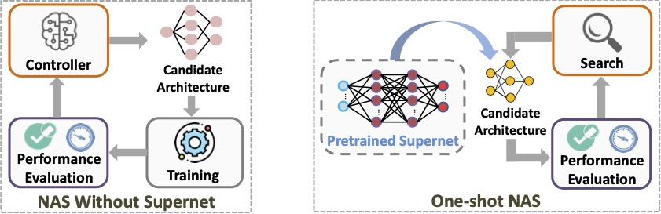
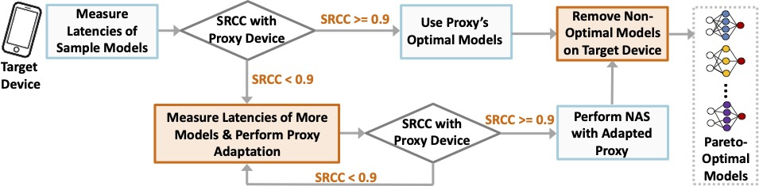
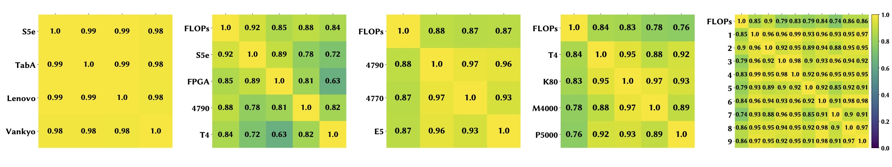
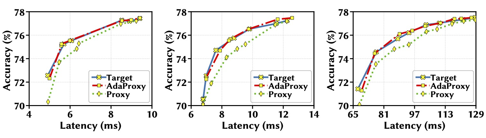
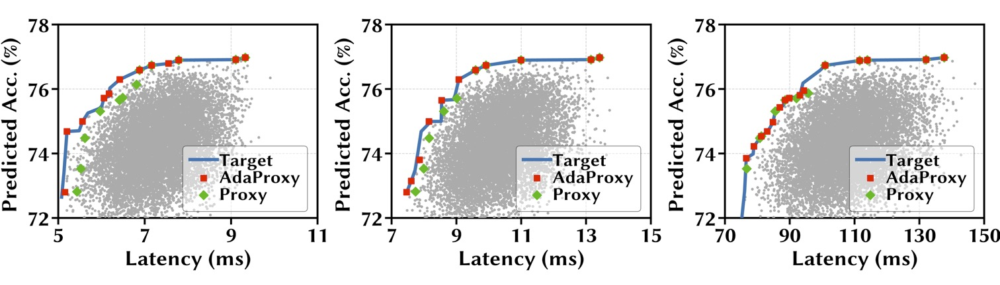
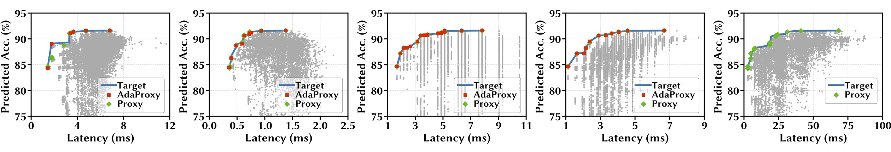

# One Proxy Device Is Enough for Hardware-Aware Neural Architecture Search

### [video](https://youtu.be) | [paper](https://arxiv.org) | [website](https://ren-research.github.io/OneProxy/) [](https://colab.research.google.com/github/Ren-Research/OneProxy/blob/main/example.ipynb)

[One Proxy Device Is Enough for Hardware-Aware Neural Architecture Search](https://arxiv.org/)

Bingqian Lu, Jianyi Yang, Weiwen Jiang, Yiyu Shi, [Shaolei Ren](https://intra.ece.ucr.edu/~sren/)

UC Riverside, George Mason University, University of Notre Dame

In Sigmetrics 2022

```BibTex
@inproceedings{
  luOneProxy2022,
  title={One Proxy Device Is Enough for Hardware-Aware Neural Architecture Search},
  author={Bingqian Lu and Jianyi Yang and Weiwen Jiang and Yiyu Shi and Shaolei Ren},
  booktitle={ACM SIGMETRICS},
  year={2022},
  url={https://arxiv.org/}
}
```


## Overview of NAS algorithms



Left: NAS without a supernet. Right: One-shot NAS with a supernet.


Cost Comparison of Hardware-aware NAS Algorithms for 𝑛 Target Devices.


## Using one proxy device for hardware-aware NAS




## Using Spearman’s Rank Correlation Coefficient (SRCC) to measure latency monotonicity

Latency monotonicity in the real world


SRCC of 10k sampled model latencies on different pairs of mobile and non-mobile devices.


## Increasing Latency Monotonicity by Adapting the Proxy Latency Predictor






Exhaustive search results for different target devices on NAS-Bench-201 architectures (CIFAR-10 dataset). Pixel3 is the proxy.

