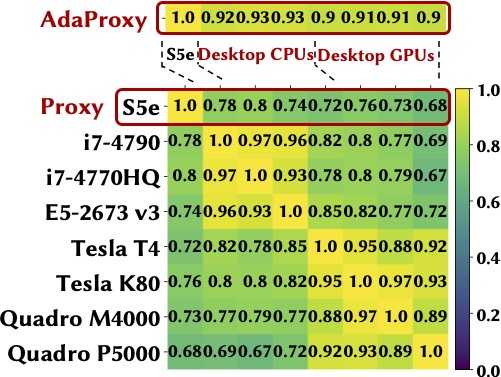

# One Proxy Device Is Enough for Hardware-Aware Neural Architecture Search

### [video](https://youtu.be) | [paper](https://arxiv.org) | [website](https://ren-research.github.io/OneProxy/) [](https://colab.research.google.com/github/Ren-Research/OneProxy/blob/main/example.ipynb)

[One Proxy Device Is Enough for Hardware-Aware Neural Architecture Search](https://arxiv.org/)

Bingqian Lu, Jianyi Yang, Weiwen Jiang, Yiyu Shi, [Shaolei Ren](https://intra.ece.ucr.edu/~sren/), Proceedings of the ACM on Measurement and Analysis of Computing Systems, vol. 5, no. 3, Dec, 2021. (**SIGMETRICS 2022**)

```BibTex
@article{
  luOneProxy2021,
  title={One Proxy Device Is Enough for Hardware-Aware Neural Architecture Search},
  author={Bingqian Lu and Jianyi Yang and Weiwen Jiang and Yiyu Shi and Shaolei Ren},
  journal = {Proceedings of the ACM on Measurement and Analysis of Computing Systems}, 
  month = Dec,
  year = 2021,
  volume = {5}, 
  number = {3},
  articleno = {34}, 
  numpages = {35},
}
```

## Hardware-aware NAS Dilemma

CNNs are used in numerous real-world applications such as vision-based autonomous driving and video content analysis. To run CNN inference on various target devices, hardware-aware neural architecture search (NAS) is crucial. A key requirement of efficient hardware-aware NAS is the fast evaluation of inference latencies in order to rank different architectures. While building a latency predictor for each target device has been commonly used in state of the art, this is a very time-consuming process, lacking scalability in the presence of extremely diverse devices.


### Overview of SOTA NAS algorithms


Left: NAS without a supernet. Right: One-shot NAS with a supernet.


Cost Comparison of Hardware-aware NAS Algorithms for 𝑛 Target Devices.


## Our approach: exploiting latency monotonicity

We address the scalability challenge by exploiting latency monotonicity — the architecture latency rankings on different devices are often correlated. When strong latency monotonicity exists, we can re-use architectures searched for one proxy device on new target devices, without losing optimality.

### Using SRCC to measure latency monotonicity

To quantify the degree of latency monotonicity, we use the metric of Spearman’s Rank Correlation Coefficient (SRCC), which lies between -1 and 1 and assesses statistical dependence between the rankings of two variables using a monotonic function. The greater the SRCC of CNN latencies on two devices, the better the latency monotonicity. SRCC of 0.9 to 1.0 is usually viewed as strongly dependent in terms of monotonicity.

We empirically show the existence of strong latency monotonicity among devices of the same platform, including mobile, FPGA, desktop GPU and CPU.


SRCC of 10k sampled models latencies in MobileNet-V2 space on different pairs of mobile and non-mobile devices.


## In the absence of strong latency monotonicity: adapting the proxy latency predictor

### AdaProxy for boosting latency monotonicity

We exploit the correlation among devices and propose efficient transfer learning to boost the otherwise possibly weak latency monotonicity for a target device.

<p align="center">
  
</p>

In the MobileNet-V2 space, with S5e as default proxy device


In the NAS-Bench-201 search space on CIFAR-10 (left), CIFAR-100 (middle) and ImageNet16-120 (right) datasets, with Pixel3 as our proxy device


In the FBNet search spaces on CIFAR-100 (left) and ImageNet16-120 (right) datasets, with Pixel3 as our proxy device


<p align="center">
  
</p>

SRCC for various devices in the NAS-Bench-201 search space with latencies collected from [19, 29, 49, 50]


## Using one proxy device for hardware-aware NAS


### One proxy for hardware-aware NAS


Results for non-mobile target devices with the default S5e proxy and AdaProxy. The top row shows the evolutionary search results with real measured accuracies, and the bottom row shows the exhaustive search results based on 10k random architectures (in the MobileNet-V2 space) and predicted accuracies.


Exhaustive search results for different target devices on NAS-Bench-201 architectures (CIFAR-10 dataset). Pixel3 is the proxy.


## Public latency datasets used in this work

[HW-NAS-Bench: Hardware-Aware Neural Architecture Search Benchmark](https://github.com/RICE-EIC/HW-NAS-Bench)

[Eagle: Efficient and Agile Performance Estimator and Dataset](https://github.com/SamsungLabs/eagle)

[nn-Meter: towards accurate latency prediction of deep-learning model inference on diverse edge devices](https://github.com/microsoft/nn-Meter)

[Once for All: Train One Network and Specialize it for Efficient Deployment](https://github.com/mit-han-lab/once-for-all)
