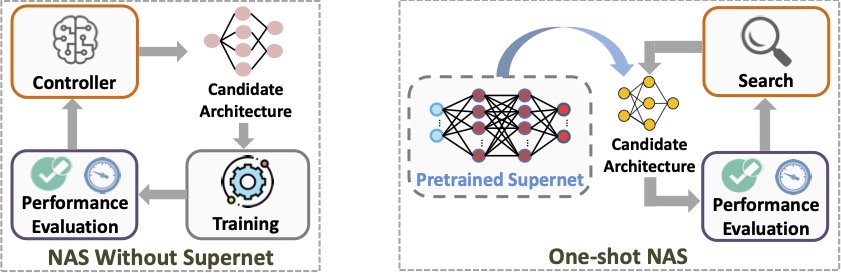
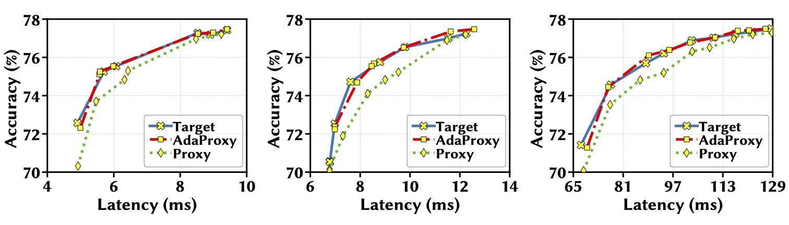
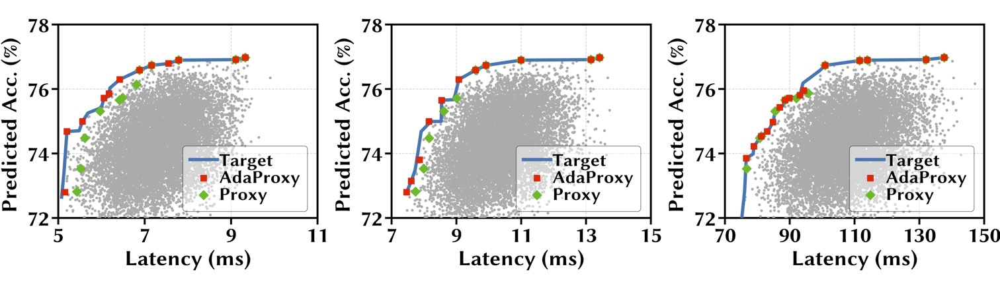
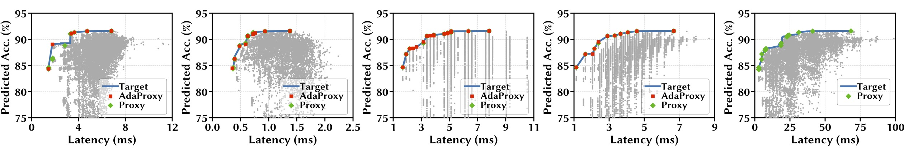

# One Proxy Device Is Enough for Hardware-Aware Neural Architecture Search

### [video](https://youtu.be) | [paper](https://arxiv.org) | [website](https://ren-research.github.io/OneProxy/) [](https://colab.research.google.com/github/Ren-Research/OneProxy/blob/main/example.ipynb)

[One Proxy Device Is Enough for Hardware-Aware Neural Architecture Search](https://arxiv.org/)

Bingqian Lu, Jianyi Yang, Weiwen Jiang, Yiyu Shi, [Shaolei Ren](https://intra.ece.ucr.edu/~sren/), UC Riverside, In SIGMETRICS 2022

```BibTex
@inproceedings{
  luOneProxy2021,
  title={One Proxy Device Is Enough for Hardware-Aware Neural Architecture Search},
  author={Bingqian Lu and Jianyi Yang and Weiwen Jiang and Yiyu Shi and Shaolei Ren},
  journal = {Proceedings of the ACM on Measurement and Analysis of Computing Systems}, 
  month = Dec,
  year = 2021,
  volume = {5}, 
  number = {3},
  articleno = {34}, 
  numpages = {35},
}
```

## Hardware-aware NAS Dilemma

CNNs are used in numerous real-world applications such as vision-based autonomous driving and video content analysis. To run CNN inference on various target devices, hardware-aware neural architecture search (NAS) is crucial. A key requirement of efficient hardware-aware NAS is the fast evaluation of inference latencies in order to rank different architectures. While building a latency predictor for each target device has been commonly used in state of the art, this is a very time-consuming process, lacking scalability in the presence of extremely diverse devices.


## Overview of SOTA NAS algorithms



Left: NAS without a supernet. Right: One-shot NAS with a supernet.


Cost Comparison of Hardware-aware NAS Algorithms for 𝑛 Target Devices.


## Our approach: exploiting latency monotonicity

We address the scalability challenge by exploiting latency monotonicity — the architecture latency rankings on different devices are often correlated. When strong latency monotonicity exists, we can re-use architectures searched for one proxy device on new target devices, without losing optimality.

### Using SRCC to measure latency monotonicity

To quantify the degree of latency monotonicity, we use the metric of Spearman’s Rank Correlation Coefficient (SRCC), which lies between -1 and 1 and assesses statistical dependence between the rankings of two variables using a monotonic function. The greater the SRCC of CNN latencies on two devices, the better the latency monotonicity. SRCC of 0.9 to 1.0 is usually viewed as strongly dependent in terms of monotonicity.

Latency monotonicity in the real world


SRCC of 10k sampled model latencies on different pairs of mobile and non-mobile devices.


## In the absence of strong latency monotonicity: adapting the proxy latency predictor

### SOTA latency predictors

**Operator-level latency predictor.** A straightforward approach is to first profile each operator (or each layer), and then sum all the operator-level latencies as the end-to-end latency of an architecture. Specifically, given 𝐾 operators (e.g., each with a searchable kernel size and expansion ratio), we can represent each operator using one-hot encoding: 1 means the respective operator is included in an architecture, and 0 otherwise. Thus, an architecture can be represented as x ∈ {0, 1}𝐾 ∪ {1}, where the additional {1} represents the non-searchable part, e.g., fully-connected layers in CNN, of the architecture. Accordingly, the latency predictor can be written as 𝑙 = w𝑇 x, where w ∈ R𝐾+1 is the operator-level latency vector. This approach needs a few thousands of latency measurement samples (taking up a few tens of hours).


**GCN-based latency predictor.** To better capture the graph topology of different operators, a recent study uses a graph convolutionary network (GCN) to predict the inference latency for a target device. Concretely, the latency predictor can be written as 𝑙 = 𝐺𝐶𝑁 Θ (x), where Θ is the GCN parameter learnt based on latency measurement samples and x is the graph-based encoding of an architecture.


**Kernel-level latency predictor.** Another recent latency predictor is to use a random forest to estimate the latency for each execution unit (called “kernel”) that captures different compilers and execution flows, and then sum up all the involved execution units as the latency of the entire architecture. This approach unifies different DNN frameworks, such as TensorFlow and Onnx, into a single model graph, and hence can predict latencies for models developed using different frameworks. By encoding an architecture based on the execution units, we can also transform the latency predictor into a linear one: 𝑙 = w𝑇 x where w is the vector of latencies for different execution units and x denotes the number of each execution unit included in an architecture. Thus, an “execution unit” in nn-Meter is conceptually equivalent to a searchable operator in the operator-level latency predicto.


### AdaProxy for boosting latency monotonicity


## Using one proxy device for hardware-aware NAS


### One proxy for hardware-aware NAS






Exhaustive search results for different target devices on NAS-Bench-201 architectures (CIFAR-10 dataset). Pixel3 is the proxy.
